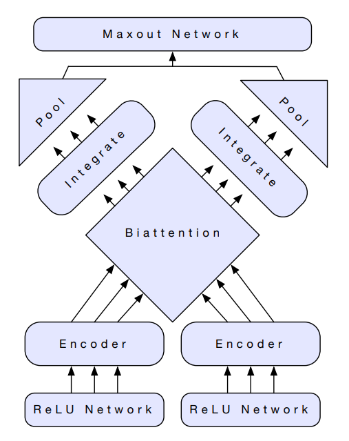

# SmileDB Text Classification


## Data Preprocessing and EDA

- It was observed that the target distribution was not uniform.
- It was observed that *num_sentence* and *reflection_period* did not correlate with the targets and are unnecessary for training.
- The text in `hm_train.csv` and `hm_test.csv` was tokenized and joined with spaces in between. This was done to make sure that all tokens (including punctuations) are space-separated. The cleaned data was saved in `hm_train_cleaned.csv` and `hm_test_cleaned.csv` respectively.
- The training data was split into train and validation sets and saved in `train.csv` and `test.csv`.

The code for preprocessing and EDA is pressent in `preprocessing.ipynb`. 


## Approaches Explored

- TextCNN
- Bi-attentive Classification Network

### TextCNN

The TextCNN consisted of a 3-layer 1D ConvNet followed by two Dense layers. 300 dimensional GloVe word embeddings were used for word vectorization. Dropout was used to avoid overfitting. Despite adding dropout, val accuracy was saturating, while training accuracy was increasing. Weighted cross-entropy loss was used to tackle the class imbalance. The code for the experiment is present in the notebook `TextCNN/TextCNN.ipynb`. 

**Score on submission: 0.8645**

### Bi-attentive Classification Network

The approach and the model architecture was introduced in the [Contextualized Word Vectors](https://arxiv.org/pdf/1708.00107.pdf) paper. A brief overview goes as follows:

1. The input text sequence S = [w<sub>1</sub>, w<sub>2</sub>, w<sub>3</sub>, ..... w<sub>n</sub>]  is vectorized using an embedding of choice. Let the vectors be denoted by 

   >  E = [e<sub>1</sub>, e<sub>2</sub>, e<sub>3</sub>, ..... e<sub>n</sub>] 

   >  where n = No. of words in sequence

2. The vectorized sequence is duplicated to give two copies of the same - E<sub>1</sub> and E<sub>2</sub>.

3. A feedforward network with ReLU activation is used on each word vector. This is the pre-encoding step used for dimensionality reduction of the embeddings.

   >  E<sub>1</sub>' = FC_Layer(E<sub>1</sub>)

   >  E<sub>2</sub>' = FC_Layer(E<sub>2</sub>)

4. The output is then passed through a Bi-directional LSTM to obtain context aware representations of the words in the input sequence.

   > X = Bi-LSTM(E<sub>1</sub>')

   > Y = Bi-LSTM(E<sub>2</sub>')

5. Compute A<sub>nxn</sub> = XY<sup>T</sup>. The matrix will contain the dot products of each x<sub>i</sub> with every y<sub>i</sub>. Intutively, it will contain information on how each word is related to every other in the input sequence.

6. Compute:

   > A<sub>x</sub> = *softmax*(A)

   > A<sub>y</sub> = *softmax*(A<sup>T</sup>)

   where *softmax*() represents column wise softmax. Here, A<sub>x</sub> and A<sub>y</sub> will be nxn matrices where each column sums to 1. This gives us normalized weights which can be used for attention.

7. In this step we apply the attention weights obtained, to the corresponding matrices X and Y.

   > C<sub>x</sub> = A<sub>x</sub><sup>T</sup> . X

   > C<sub>y</sub> = A<sub>y</sub><sup>T</sup> . Y

8. The conditioned matrices C<sub>x</sub> and C<sub>y</sub> along with X and Y are passed through another Bi-LSTM to integrate the obtained information.

   > X<sub>|Y</sub> = Bi-LSTM(X, C<sub>y</sub>)

   > Y<sub>|X</sub> = Bi-LSTM(Y, C<sub>x</sub>)

   These outputs are then min-pooled along the column.

9. The pooled representations X<sub>pool</sub> and Y<sub>pool</sub> are then concatenated and passed through a final Dense layer with softmax at the end to obtain the probablity distribution over the classes.




## Implementation Details

### TextCNN

Libraries used:

- **Keras:** Used for training 
- **Scikit-Learn:**  Used for preprocessing and metrics

For more details, refer to `TextCNN/TextCNN.ipynb`. The notebook contains code for loading data, building and training the model and predicting on the test set.

**Score: 0.8645**

### Bi-attentive Classification Network

**AllenNLP**, a high level NLP research library was used for this purpose. The library had to be extended to add support for reading from and predicting on differently formatted data. The library extension can be found in the `BCN/mylibrary` folder. A customizable implementation of the Bi-attentive Classification Network is available in the library. Many experiments were performed with different choices of word embeddings, model size, learning rates and learning rate schedulers:

- 300 Dimensional GloVe embeddings + Medium Sized model + lr=0.001 + 20 epochs 

  (See `BCN/bcn.jsonnet`)

  **Score: 0.8766**

- 300 Dimensional GloVe embeddings + Medium Sized model + lr=0.0005 + LR scheduler (lr/2 on plateau for 3 epochs) + 15 epochs 

  (See `BCN/bcn_lrscheduler.jsonnet`)

  The model seemed to overfit in the later epochs. Best val accuracy was in the 12<sup>th</sup> epoch. Perhaps increasing dropout can help.

  **Score: 0.8827**

- 300 Dimensional GloVe + 512 Dimensional ELMo embeddings + Large Sized Model + lr=0.0005

  (See `BCN/bcn_glove_elmo.jsonnet`)

  This configuration caused memory error even on a reduced batch size of 32 (from 100).

- 300 Dimensional GloVe + 128 Dimensional ELMo embeddings + Small Sized Model + lr=0.001 

  (See `BCN/bcn_elmo_small.jsonnet`)

  This configuration also caused memory error even on a small batch size.

- 50 Dimensional GloVe + 128 Dimensional ELMo embeddings + Small Sized Model + lr=0.001

  (See `BCN/bcn_glove_small_elmo_small.jsonnet`)

  Was taking a long time to train (1.5 hrs per epoch). The validation metrics for the 1<sup>st</sup> and 2<sup>nd</sup> epoch were not impressive. Training was cancelled and no submission was made.

- 768 Dimensional BERT Embeddings + Medium Sized Model + lr=0.0005 + 10 epochs

  (See `BCN/bcn_bert.jsonnet`)

  The accuracy increased rapidly in the early epochs but was saturating after the 8<sup>th</sup> epoch.

  Perhaps learning rate scheduling can help.

  **Score: 0.8738**

##### Running the code

The `BCN/*.jsonnet` files are configuration files that AllenNLP uses to build the model architecture and train models. The paths to training and validation data are present in these config files.

The training and prediction scripts are provided in the `BCN/`folder.

For training:

```bash
python3 train.py /path/to/config.jsonnet /path/to/model/folder
```

For predictions:

```
python3 predict.py /path/to/model.tar.gz /path/to/test.csv /path/to/submission.csv
```


## Directory Structure

. <br>
├── BCN <br>
│   ├── mylibrary <br>
│   │   ├── data <br>
│   │   │   ├── dataset_readers <br>
│   │   │   │   ├── \_\_init\_\_.py <br>
│   │   │   │   └── smiledb.py <br>
│   │   │   └── \_\_init\_\_.py <br>
│   │   ├── predictors <br>
│   │   │   ├── \_\_init\_\_.py <br>
│   │   │   └── smiledb.py <br>
│   │   └── \_\_init\_\_.py <br>
│   ├── bcn_bert.jsonnet <br>
│   ├── bcn_elmo_small.jsonnet <br>
│   ├── bcn_glove_elmo.jsonnet <br>
│   ├── bcn_glove_small_elmo_small.jsonnet <br>
│   ├── bcn.jsonnet <br>
│   ├── bcn_lrscheduler.jsonnet <br>
│   ├── predict.py <br>
│   └── train.py <br>
├── TextCNN <br>
│   └──TextCNN.ipynb <br>
├── hm_test_cleaned.csv <br>
├── hm_test.csv <br>
├── hm_train_cleaned.csv <br>
├── hm_train.csv <br>
├── install_requirements.sh <br>
├── preprocessing.ipynb <br>
├── README.md <br>
├── requirements.txt <br>
├── test.csv <br>
└── train.csv <br>

